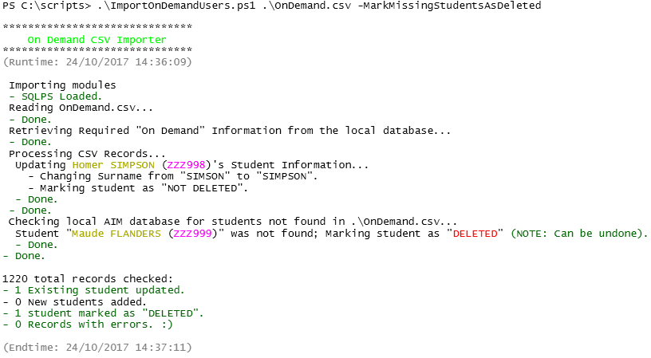

# OnDemand Import Script

This script will read a valid (see below) OnDemand Csv Student Import file, check the local On Demand database for any required additions/modifications, and inserts/updates records as needed. Use this script for automating On Demand imports.

## Main Features:
* Imports a valid On Demand CSV file to create new, and modify existing On Demand users.
* Can be automated via a `.bat` file (example included) to bring relief to your On Demand admin.
* `NULL` `STDNT_EXTRNL_XID` values are auto-corrected to `STDNT_XID`.
* Empty `STDNT_MDL_NAME` and `HOME_GRP_NAME` values are corrected to `NULL` (if required).
* School ID auto-detected, unless you have multiple schools on the same server- if so, school IDs are shown so that you can specify the ID.
* Auto-cleaning of CSV files- E.g. "P" year levels, are auto-converted to the "F" that OnDemand expects.
* Ability to mark students *not* in the imported CSV as "DELETED" (disabled by default).
* Colourised output (if run in a powershell console).

## Screenshot:


## Getting Started
### Prerequisites:
* SQL Server PowerShell Module (SQLPS) (already installed on OnDemand servers)
* PowerShell v3.0+
* Script Run "As Administrator"
* Script Run Under Account with SQL Database Read/Write Access on the On Demand Server (e.g. "School Admin" account)

### CSV Requirements:
Required CSV headers:
```
student_code,first_name,middle_name,surname,gender,date_of_birth,LBOTE,ATSI,disability_status,EMA,ESL,home_group,year_level
```
Valid CSV Values ([Source](http://webcache.googleusercontent.com/search?q=cache:k5dtnZVSvCAJ:www.vcaa.vic.edu.au/Documents/ondemand/ondteachertrainingguide.pdf+&cd=1&hl=en&ct=clnk&gl=au#31)):

| Field             | Description                                 | Accepted Values                                                                     | Mandatory? |
| ----------------: | ------------------------------------------- | ------------------------------------------------------------------------------------|------------|
| student_code      | Student's CASES code                        | Any string 1-20 characters long.                                                    | Yes        |
| first_name        | Student's first name                        | Any string 1-40 characters long.                                                    | Yes        |
| middle_name       | Student's middle name                       | Any string 0-40 characters long.                                                    | No         |
| surname           | Studnet's surname                           | Any string 1-40 characters long.                                                    | Yes        |
| gender            | Student's gender                            | "M", "MALE", "F", "FEMAL", "FEMALE".                                                | Yes        |
| date_of_birth     | Student's date of <br> birth                | "MMM d yyyy" (e.g. Jan 1 2000), or <br> "d/MM/yyyy" (e.g. 1/01/2000).               | Yes        | 
| LBOTE             | Language Background <br> Other Than English | "1", "T", "True", "Y", "Yes" for TRUE; <br> "0", "F", "False", "N", "No" for FALSE. | Yes        |
| ATSI              | Aboriginal or Torres <br> Strait Islander   | "1", "T", "True", "Y", "Yes" for TRUE; <br> "0", "F", "False", "N", "No" for FALSE. | Yes        |
| disability_status | If the student has a <br> disability or not | "1", "T", "True", "Y", "Yes" for TRUE; <br> "0", "F", "False", "N", "No" for FALSE. | Yes        |
| EMA               | Education Maintenance <br> Allowance        | "1", "T", "True", "Y", "Yes" for TRUE; <br> "0", "F", "False", "N", "No" for FALSE. | Yes        |
| ESL               | English as a Second <br> Language           | "1", "T", "True", "Y", "Yes" for TRUE; <br> "0", "F", "False", "N", "No" for FALSE. | Yes        |
| home_group        | Students home group                         | Any string 0-40 characters long.                                                    | No         |
| year_level        | Student's year level                        | Numbers 0-12 (Can be with or without leading zeros),<br>"P", "F", "UG".             | Yes        |

### Instructions:
1. Download both `ImportOnDemandUsers.bat` and `ImportOnDemandUsers.ps1`.
2. Modify `ImportOnDemandUsers.bat` to point to a network share that houses your eduHub OnDemand export (`line 9`), and specify the name of the CSV and the log file (`line 12`):
3. Log in to your school's local On Demand server as the user `SchlAdmin`.
4. Copy the script files to the On Demand server (e.g. `C:\Scripts\`).
5. Create a scheduled task to run the `.bat` file ("with highest privileges") whenever you would like the imports to be done. (I do mine at 8am, and repeat every hour for 7 hours)

**Note:** If the script warns you that you need to select a school, please modify the `.bat` file to include the school's ID as per the error message:
e.g If the error says to use school ID of `1234`, then use:

```powershell
PowerShell.exe -ExecutionPolicy Bypass -Command "& '%~dpn0.ps1' 'L:\OnDemand.csv' 1234" >> L:\OnDemand.log
```

### Examples:

Import "OnDemand.csv" from the "C:\My Files\" directory:

```powershell
.\ImportOnDemandUsers.ps1 "C:\My Files\OnDemand.csv"
```

Import "OnDemand.csv" from the "C:\My Files\" directory, using the SchoolID of "1234" (only use if omitting the SchoolID gives you an error with a list of schools):

```powershell
.\ImportOnDemandUsers.ps1 "C:\My Files\OnDemand.csv" 1234
```

Import "OnDemand.csv" from the "C:\My Files\" directory, and disable extended student checking:

```powershell
.\ImportOnDemandUsers.ps1 "C:\My Files\OnDemand.csv" -SkipExtendedRecordChecks
```

Import "OnDemand.csv" from the "C:\My Files\" directory, and mark any existing student *not* in the CSV as "DELETED":

```powershell
.\ImportOnDemandUsers.ps1 "C:\My Files\OnDemand.csv" -MarkMissingStudentsAsDeleted
```

Use this to run the script as part of a scheduled task:

```powershell
powershell.exe -ExecutionPolicy Bypass -Command "& 'c:\scripts\ImportOnDemandUsers.ps1' 'C:\My Files\OnDemand.csv'"
```

Use this to run the script as part of a scheduled task, and append the output to a log file:

```powershell
powershell.exe -ExecutionPolicy Bypass -Command "& 'c:\scripts\ImportOnDemandUsers.ps1' 'C:\My Files\OnDemand.csv'" >> c:\scripts\ImportOnDemandUsers.log
```

<br><br>
***Note:*** *Due to the way that `Write-Host` works, the following command* ***will not*** *work in writing to the log file, as `Write-Host` is not piped to the log:*

```powershell
.\ImportOnDemandUsers.ps1 .\OnDemand.csv >> .\ImportOnDemandUsers.log
```

# Notes:
* This script, by default, checks for existing students by matching the student code ("student_code"/"STDNT_XID"), and at least 2 of: "first_name", "surname", and "date_of_birth". To match by "student_code" alone, run the script with the `-SkipExtendedRecordChecks` switch.
* This script, by default, will only import new users or modify existing accounts. It will not mark students as "DELETED" unless run with the `-MarkMissingStudentsAsDeleted` switch.
* If the database has no existing students, the first record will start at "<b>[SCHL_ID]</b>000000<b>1</b>000" (e.g. for a school with an ID of "1337", the first record ID will be "<b>1337</b>000000<b>1</b>000").
* If piping the output to a log file, the log file will not be coloured, as it's just a text file. Only console output will be coloured.

# Authors:

* **Robert Brandon** - *Initial work*
 
# Changelog:
## v1.4 (08/11/2017)
* Bugfix - Fixed ATSI, disability_status, EMA, ESL values being set to the value of LBOTE instead of their respective values.

## v1.3 (06/11/2017)
* Fix handling of NULL STDNT_MDL_NAME and HOME_GRP_NAME values to be NULL instead of an empty string.

## v1.2 (01/11/2017)
* Any records with "P" as the year will automatically be converted to "F" before inserting into the DB.
* NULL stdnt_extrnl_xid entries will be fixed automatically.

## v1.1 (24/10/2017)
* Added extended student match checking.
* Added coloured output.
* Added option to mark students not in the CSV as "DELETED".
* Added output saying *what* changed with a student record to cause the update.

## v1.0 (10/10/2017)
* Initial Release